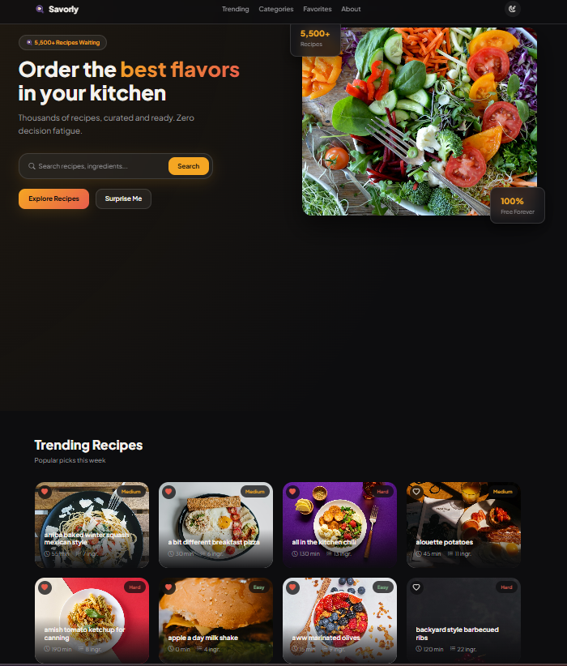
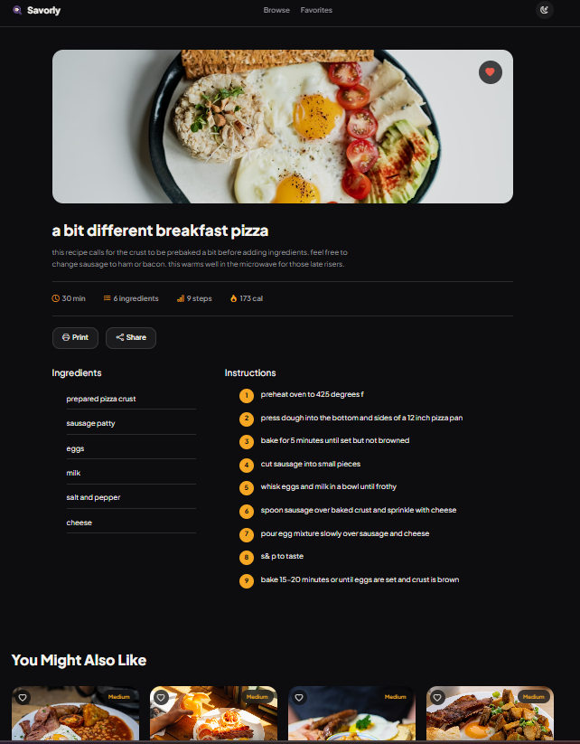
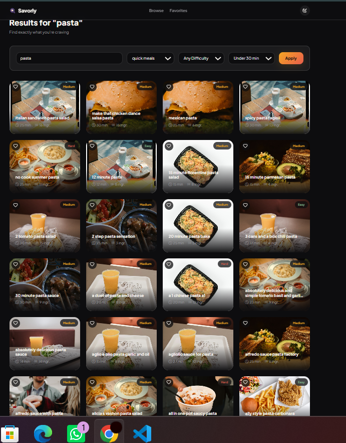
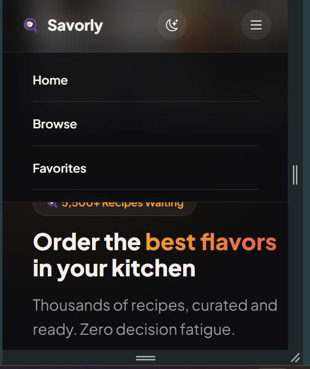
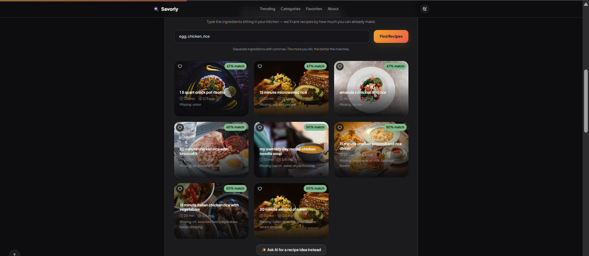
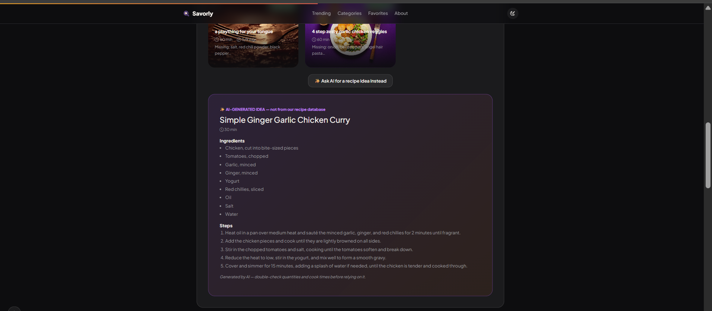

# 🍳 Savorly — Recipe Discovery Platform

> Discover what to cook next. A modern, full-stack recipe discovery platform built with Node.js, Express, SQLite, and vanilla JavaScript.


## 🔗 Live Demo

- **Frontend:** [savorly-seven.vercel.app](https://savorly-seven.vercel.app)
- **Backend API:** [savorly-ajwr.onrender.com/api/health](https://savorly-ajwr.onrender.com/api/health)

> ⚠️ The backend is on Render's free tier and sleeps after 15 minutes of inactivity. The first request after sleep can take 30–50 seconds to respond while it wakes up — this is expected, not a bug. Subsequent requests are fast.

## 📖 Overview

Savorly is a portfolio-scale recipe discovery platform featuring over 5,500 curated recipes — plus an AI-powered "Cook With What You Have" tool that turns whatever's in your kitchen into recipe suggestions. Built with a dark, premium aesthetic inspired by modern consumer products, it demonstrates full-stack development: a REST API backend, a SQLite database, a self-built ingredient-matching algorithm, an LLM integration (Google Gemini), and a responsive, animated frontend — all without a heavy frontend framework.

## ✨ Features

- 🥘 **Cook With What You Have** — type the ingredients you own, and a self-built scoring algorithm ranks all 5,500+ recipes by how much of each you can already make (shows missing ingredients too)
- ✨ **AI recipe suggestions** — when nothing in the database fits well, an optional Google Gemini integration generates a brand-new recipe idea from your ingredients on the fly
- 🔍 Live search with combinable filters (category, difficulty, cook time)
- 📖 Detailed recipe pages with ingredients, steps, and nutrition info
- ❤️ Favorites system (persisted via localStorage)
- 🎲 "Surprise Me" random recipe discovery
- 🌗 Light/dark theme toggle (persists across sessions)
- 📱 Fully responsive, including a mobile hamburger menu
- 🖨️ Print-friendly recipe pages
- 🔗 Native share sheet integration
- ✨ Skeleton loading states, toast notifications, scroll-reveal animations
- 📊 Scroll progress bar and back-to-top button

## 🛠️ Tech Stack

**Frontend:** HTML5, CSS3, Bootstrap 5, Vanilla JavaScript
**Backend:** Node.js, Express.js
**Database:** SQLite (via better-sqlite3)
**AI:** Google Gemini API (recipe suggestion fallback)
**Testing:** Jest, Supertest, GitHub Actions (CI)
**Images:** Unsplash API
**Version Control:** Git & GitHub

## 📸 Screenshots

| Homepage | Recipe Detail |
|---|---|
|  |  |

| Search & Filters | Mobile View |
|---|---|
|  |  |

| Cook With What You Have | AI Recipe Suggestion |
|---|---|
|  |  |

## 📁 Project Structure

```
Recipe_Book/
├── frontend/
│   ├── pages/          # HTML pages (index, search, recipe, favorites)
│   ├── styles/         # CSS — base tokens, components, page-specific
│   ├── scripts/        # JS — API layer, components, utilities, pages
│   └── assets/
├── backend/
│   ├── api/
│   │   ├── routes/       # URL → controller mapping
│   │   ├── controllers/  # Request/response handling
│   │   └── models/       # Database queries
│   ├── config/          # Database connection setup
│   └── data/            # Import script, raw CSV, generated database
├── docs/
│   ├── screenshots/     # README images
│   ├── ARCHITECTURE.md
│   └── DESIGN.md
└── README.md
```

## 🚀 Getting Started

### Prerequisites
- Node.js (v18+)
- A free [Unsplash Developer](https://unsplash.com/developers) account

### Installation

```bash
git clone https://github.com/Zunaira48/savorly.git
cd Recipe_Book/backend
npm install
```

### Set Up the Database

1. Download `RAW_recipes.csv` from [Kaggle's Food.com dataset](https://www.kaggle.com/datasets/shuyangli94/food-com-recipes-and-user-interactions) and place it at `backend/data/raw/RAW_recipes.csv`
2. Create `backend/.env` with your Unsplash key:
   ```
   UNSPLASH_ACCESS_KEY=your_key_here
   ```
3. (Optional) Add a free [Google Gemini API key](https://aistudio.google.com/app/apikey) to the same `.env` file to enable AI recipe suggestions:
   ```
   GEMINI_API_KEY=your_key_here
   ```
   Without this key, the ingredient matcher's algorithm-based results still work fully — only the optional "✨ Ask AI" fallback is disabled.
4. Build the image pool and import the recipes:
   ```bash
   node data/fetchImages.js
   node data/import.js
   ```

### Run the App

```bash
node server.js
```

Backend runs at `http://localhost:5000`. Open `frontend/pages/index.html` with a local server (e.g. VS Code's Live Server extension) to run the frontend.

## ✅ Testing

The backend has a Jest + Supertest suite covering the API's core behavior — recipe listing, search, categories, the ingredient-matching algorithm (including a regression test for a substring-matching bug caught during development), and graceful degradation when the optional AI feature has no API key configured.

```bash
cd backend
npm test
```

Every push and pull request to `main` runs this suite automatically via [GitHub Actions](.github/workflows/ci.yml) — see the badge at the top of this README for current status.

## 🗺️ Future Improvements

- User accounts with cloud-synced favorites
- Full mobile navigation redesign beyond the current hamburger menu
- Recipe submission / user-generated content
- Nutrition-based filtering
- Meal planning calendar
- Migrate database to a persistent hosted solution (e.g. PostgreSQL) for production deployment
- Multi-turn AI chat for recipe suggestions (ask follow-up questions, refine ingredients on the fly)

## ⚠️ Known Limitations

- Favorites are stored per-device (localStorage), not synced across devices — no user accounts yet
- On serverless deployment platforms, the SQLite database is read-only in production; recipes must be imported locally before deploying
- The live backend runs on Render's free tier and sleeps after 15 minutes of inactivity — the first request after a period of idle time takes 30–50 seconds to wake up
- AI recipe suggestions depend on Google's Gemini free tier, which has daily/per-minute rate limits and is subject to change by Google — the algorithm-based ingredient matcher works independently and is unaffected if the AI fallback is ever unavailable

## 📄 License

MIT License — see [LICENSE](LICENSE) for details.

## 🙏 Credits

- Recipe data: [Food.com Recipes and Interactions](https://www.kaggle.com/datasets/shuyangli94/food-com-recipes-and-user-interactions) (Kaggle)
- Images: [Unsplash](https://unsplash.com)
- Icons: [Bootstrap Icons](https://icons.getbootstrap.com/)
